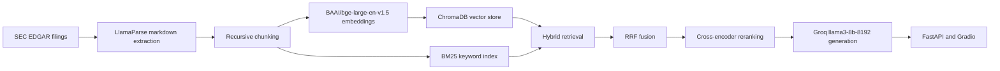

# Financial RAG

Professional hybrid RAG system for SEC 10-K and 10-Q filings from major public companies.

> Demo link: _Coming soon_

## Architecture



Architecture diagram placeholder: add a polished image version here for the GitHub landing section.

## Stack

| Layer | Tooling |
|---|---|
| Ingestion | `sec-edgar-downloader`, `WeasyPrint` |
| Parsing | `LlamaParse` with markdown table extraction |
| Chunking | `RecursiveCharacterTextSplitter`, 512 chars, 50 overlap |
| Embeddings | `sentence-transformers`, `BAAI/bge-large-en-v1.5` |
| Vector DB | `ChromaDB` persistent collection `financial_reports` |
| Keyword Search | `rank-bm25` / `BM25Okapi` |
| Fusion | Reciprocal Rank Fusion, `k=60` |
| Reranking | `cross-encoder/ms-marco-MiniLM-L-6-v2` |
| Generation | Groq API, `llama3-8b-8192`, temperature `0` |
| API | FastAPI |
| UI | Gradio |
| Evaluation | RAGAS |

## Project Structure

```text
financial-rag/
  src/
    ingestion.py
    parser.py
    chunker.py
    indexer.py
    retriever.py
    generator.py
    pipeline.py
    evaluator.py
    api.py
    ui.py
  data/
    raw/
    parsed/
    chunks.pkl
    embeddings.pkl
    bm25_index.pkl
    chroma-db/
  reports/
    evaluation_set.json
    ragas_results.json
```

## Setup

```bash
python -m venv .venv
source .venv/bin/activate
pip install sec-edgar-downloader weasyprint llama-parse llama-index python-dotenv
pip install langchain-text-splitters sentence-transformers chromadb rank-bm25 tqdm
pip install groq fastapi uvicorn gradio ragas datasets
```

Create `.env`:

```bash
SEC_DOWNLOADER_EMAIL=your.email@example.com
SEC_DOWNLOADER_COMPANY=Financial RAG Portfolio Project
LLAMA_CLOUD_API_KEY=your_llama_cloud_key
GROQ_API_KEY=your_groq_key
```

## Pipeline

Run ingestion and parsing first from Python so you can pass the returned `IngestedFiling` objects into `parse_filings`.

```python
from ingestion import run_ingestion
from parser import parse_filings
from chunker import build_chunks
from indexer import build_indexes

filings = run_ingestion()
parse_filings(filings)
build_chunks()
build_indexes()
```

## API

```bash
uvicorn api:app --app-dir src --reload
```

Endpoints:

| Method | Path | Purpose |
|---|---|---|
| `GET` | `/health` | Returns `{"status": "ok"}` |
| `POST` | `/query` | Answers a question with optional company and filing-type filters |

Example request:

```json
{
  "question": "What drove Nvidia's data center revenue?",
  "company_name": "Nvidia",
  "filing_type": "10-K"
}
```

## UI

```bash
python src/ui.py
```

The Gradio app provides a question box, company filter, filing-type filter, answer panel, and source panel.

## RAGAS Results

| Metric | Score |
|---|---:|
| Faithfulness | TBD |
| Answer Correctness | TBD |
| Context Precision | TBD |
| Context Recall | TBD |

Run:

```python
from evaluator import evaluate_pipeline

evaluate_pipeline()
```

## Portfolio Notes

This project is designed to demonstrate production ML engineering judgment:

- table-aware SEC parsing instead of lossy PDF text extraction
- reusable serialized artifacts for fast iteration
- hybrid retrieval instead of relying only on embeddings
- RRF and cross-encoder reranking for stronger retrieval quality
- deterministic generation with grounded source citations
- FastAPI and Gradio surfaces for recruiter-friendly demos
- RAGAS evaluation with a curated 30-question test set
